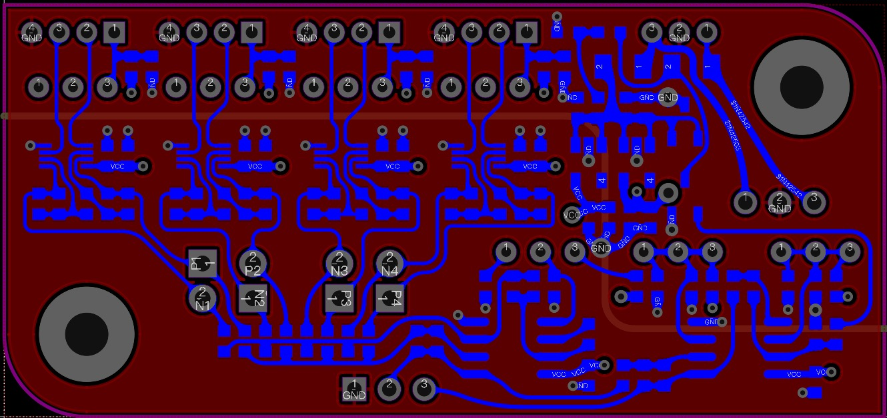
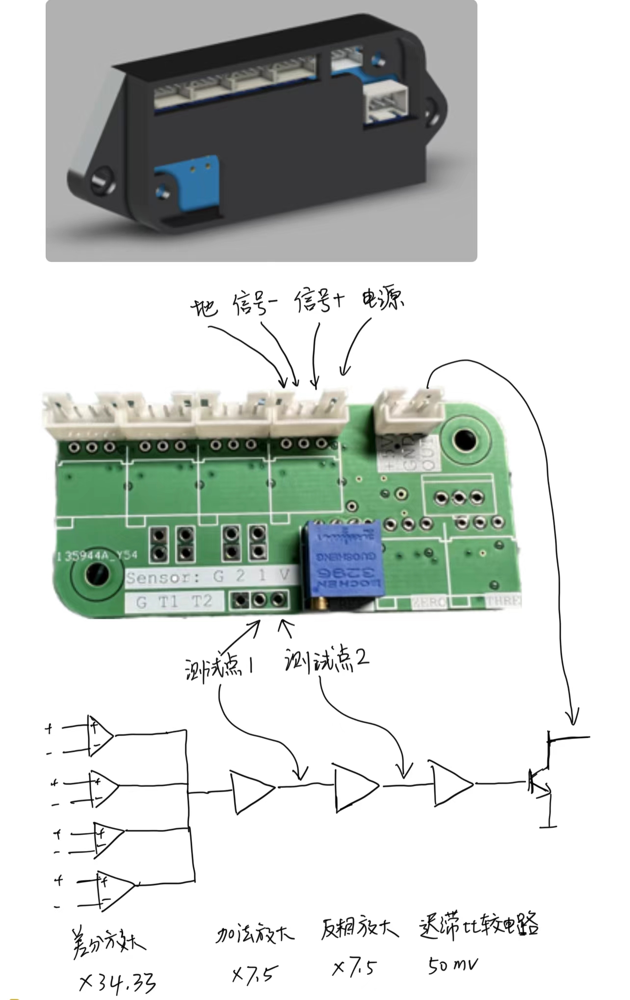

# 压力传感器放大模块

## 信号正负的区别
信号正在受到压力的时候电压比信号负高，要保证信号正在受力的时候电压高于信号负。

## 接线

* 传感器：传感器四根线都要接，如果有一个传感器接口不用，可以用假电阻替代
* 电源和输出： 电源为+5V，输出为NPN开路输出

## 指示灯

* 绿色：电源通电，没有触发，输出开路
* 橙色：电源通电，输出拉低

## 调节
所有线都接好，电源上电后开始调节
1. 在平台中间上放上合适重量的砝码，这个重量约等于触发重量
2. 顺时针旋转微调电阻，直到指示灯变绿色
3. 缓慢调节逆时针旋转调节电阻，一旦指示灯变橙色，停止旋转，调节结束
